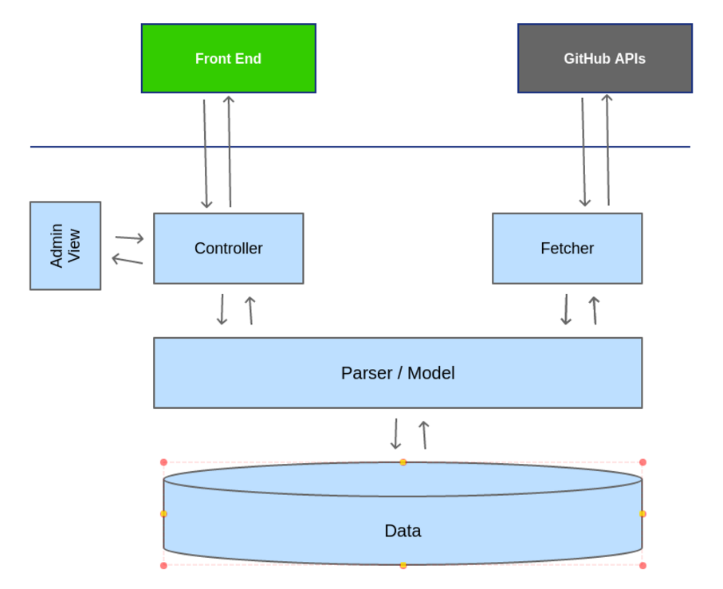

# issue_parser_backend

Backend API of issue parser app. This repository is required to successfully run the app you can find the front end client [here](https://github.com/mozillacampusclubs/issue_parser_frontend/).

## How to deploy
Find the full deployment guide [here](./docs/deploy.md).
> To successfully run full app, you have to deploy the front end client also. You can find the front end client documentation [here](https://github.com/mozillacampusclubs/issue_parser_frontend/)

## How to Contribute
You can report bugs at the [issue tracker](https://github.com/mozillacampusclubs/issue_parser_backend/issues). Find full guide on how to contribute [here](./docs/contributing.md)

> Help us by creating Pull Requests and solving [issues](https://github.com/mozillacampusclubs/issue_parser_backend/issues).

> For more in-depth knowledge of system read below `How it works`.

## How it works
This image of the system below will give you a rough overview of how api works.

There will be several components in the backend:
1. **Fetcher** : This component will fetch the data from the github API (issues in our case). This component will do only one thing i.e. fetching the data. I suggest to keep the frequency of data fetching in every 15 mins.
2. **Parser/Model** : This component will do 3 things:
Checking if the issue is passing all the quality and documentation criteria.
Parsing the data according to the schema we have for the issues.
And saving the data to database.
3. **Data** : This is database containing two table Repositories and Issues.
4. **Controller** : This is a thin layer between Model and front end. This layer will handle all the routing and REST APIs stuff.
5. **Admin View** : Admin view can be used to add or remove repos from the system.

<!--## License
To Do - discuss with mentor.-->
